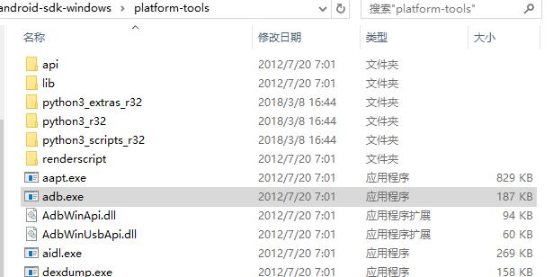
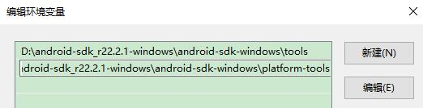
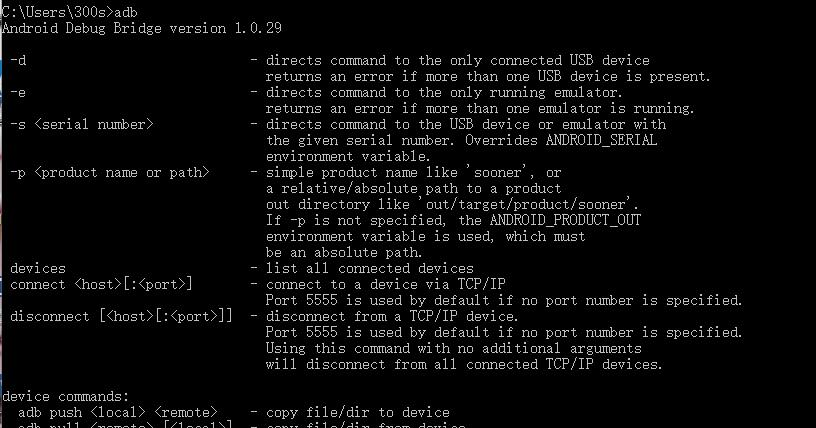
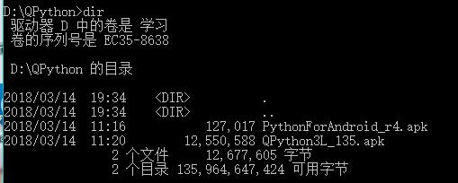
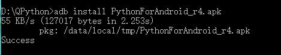
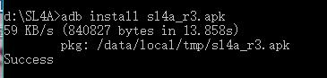
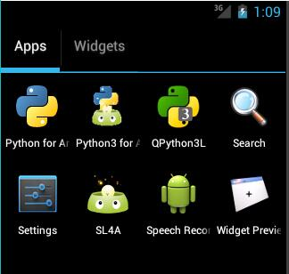

# 关于SL4A和QPython

## 关于SL4A

* SL4A是什么

  SL4A是Android应用组件，目的是支持使用简单的脚本语言来开发Android应用程序，使Android开发简单和快速。

* SL4A的原理

  SL4A系统由sl4a和RPC Server组件和脚本引擎组成，脚本引擎负责脚本应用的解释运行，SL4A RPC Server组件的作用是向脚本提供Android原生态服务。

* SL4A调用的方法

SL4A是通过RPC对android API的调用，SL4A和底层android操作系统主要通过RPC和json进行通信。

## 关于ADB 调试桥

* adb的定义

adb叫做安卓调试桥程序，测试应用程序是它的一个主要功能。adb应用是android模拟器和pc端的中介，它可以让用户在pc上以命令的方式对模拟器进行全面操作。

由于D:\android-sdk_r22.2.1-windows\android-sdk-windows\platform-tools里面已经有adb.exe，而且也已经配置了环境变量了，所以就不需要再安装adb了。





打开cmd输入 ```adb``` ，如果安装adb就会出现以下画面



## QPython

(首先要打开 Android avd)

1.在cmd找到安装qpython的安装目录，并输入```dir``` 查看下面的文件、子目录。



2.由于是apk文件所以可以直接使用adb安装,在cmd输入```QPython3L_135.apk```


在cmd输入```PythonForAndroid_r4.apk```



3.安装sl4a

在cmd输入```D:\SL4A\sl4a_r3.apk``` 



4.查看虚拟机详细信息

在cmd输入```android list avd```，安装avd成功就会出现以下界面


5.打开avd查看安装情况



安装成功！

