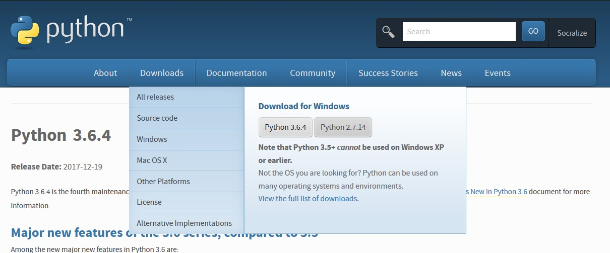
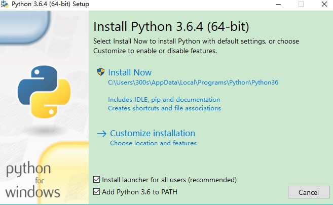
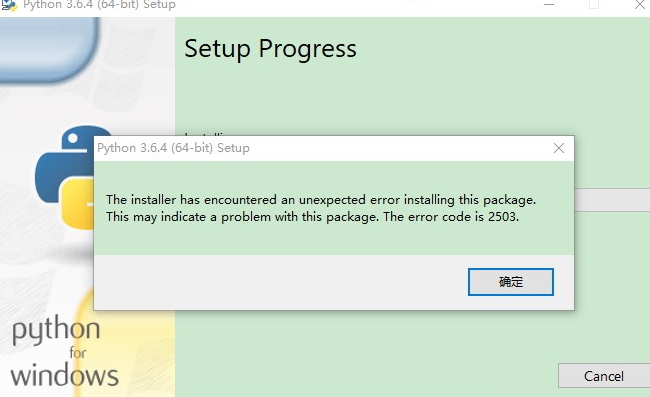
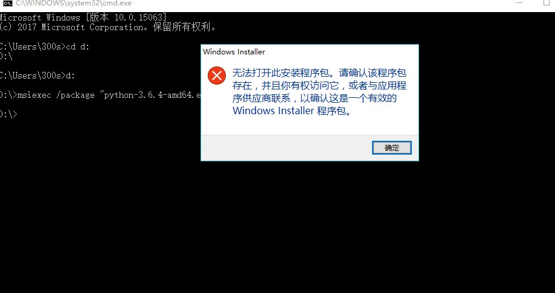
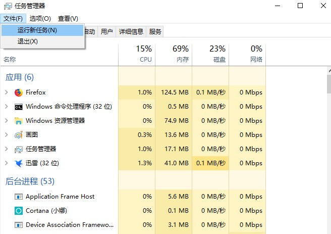
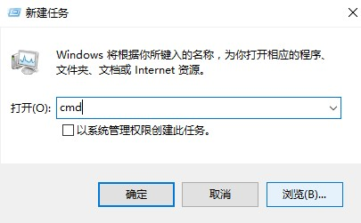
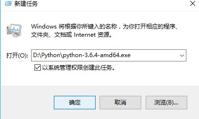

# 在win10安装python

（参考文摘：[安装Python](https://www.liaoxuefeng.com/wiki/0014316089557264a6b348958f449949df42a6d3a2e542c000/0014316090478912dab2a3a9e8f4ed49d28854b292f85bb000)）

## 1、第一种方法

1. 点击Python地址[Python 3.6.4](https://www.python.org/downloads/release/python-364/)

拉到网页下面选择适合自己的电脑的版本(如果是windows系统的64位选择Windows x86-64 executable installer，32位选择Windows x86 executable installer)


2.  在“add python 3.6 to path”的选项前打钩，这是添加环境变量



3.但是发现安装不了



## 2、第二种方法

在C盘点击"Windows",并右击“Temp”属性，选中"users(LAPTOP-SS1D30NH5/Users)"并点击“编辑”，然后在允许的下面选项全部打钩。


但是此方法仍然不行

## 3、第三种方法

我又下载了一个2.7的msi版本

在cmd以管理员身份运行，然后输入

```
msiexec /package ".msi的存放路径" 
```




## 4、 第四种方法

1.按下“CTRL”+"ALT"+"DEL"，然后会出现一个界面，选择“任务管理器”

2.点击左上角“文件”，弹出的窗口选择“运行新任务”



3.点击“浏览”，选择你的安装包的位置



4.并勾选“以系统管理权限创建此任务”，点击“确定”



5.在cmd中运行Python,出现以下界面就是安装成功了


